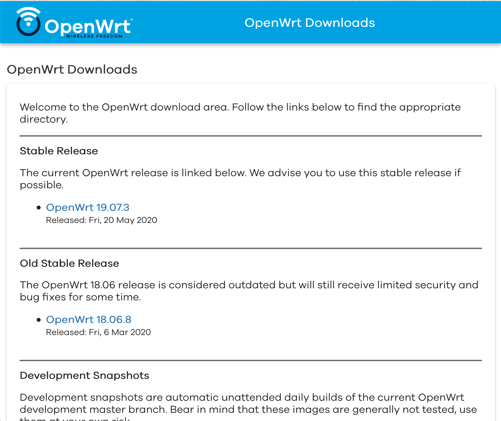
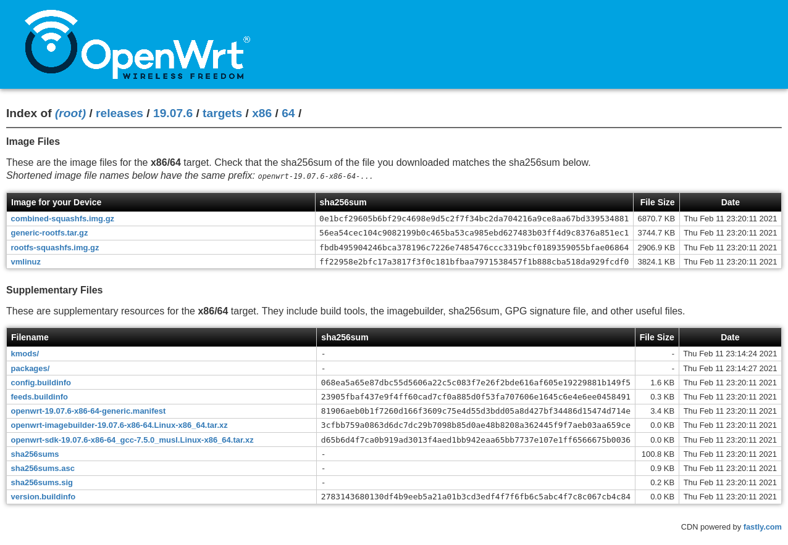
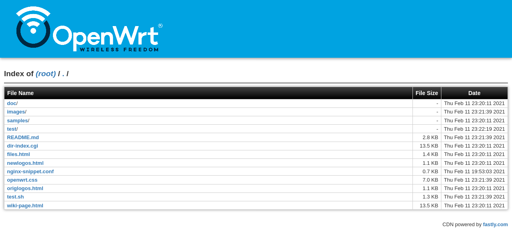

# OpenWrt Directory Listing CGI

The default Apache/nginx directory listing fails to show useful information
about OpenWrt firmware images.

This project has a CGI script that displays:

* An attractive file name (instead of the full path)
* The checksum for easy verification before flashing
* The file size and modification date
* OpenWrt styling on the page

The update to this project (June 2020) reformats the listing to display OpenWrt
styling. See the examples screen shots below.

The repo has five kinds of files:

1. **OpenWrt "targets" listing** for devices having the same target. This shows
   the image files plus supplementary files - build tools, the imagebuilder,
   sha256sum, GPG signature file, and other useful files. 
2. **Normal directory listings** with file name, size, and modification date.
3. **404 Page not found** page that displays the URL with the OpenWrt styling
4. **JSON of the directory contents**
5. **New home page** In addition, this repo contains a new home page for
   [downloads.openwrt.org](https://downloads.openwrt.org) that uses the new
   OpenWrt styling.

## Configuration

* The `dir-index.cgi` file in this repository is a CGI file that formats the
  directory contents to produce these listings
* The `nginx-snippet.conf` file is used to configure nginx on the main OpenWrt
  server to use the `dir-index.cgi` file to format the directory pages.

## Testing

The `test.sh` script creates an output file for each of the file types above. 

* [targets.html](targets.html) - the "target firmware" page
* [directory.html](directory.html) - a "normal" directory page
* [404.html](404.html) - the Page Not Found page
* [output.json](output.json) - the JSON output of the script
* [index.html](index.html) - new home page for the downloads.openwrt.org.

(This file is static, and not re-generated.)

Click the links above to see the pages in a browser.

(During development, it is necessary to save changes, run `sh test.sh`, and
reload the browser. There is an opportunity to use browser-sync or snowpack
here to automatically regenerate the file and refresh the browser after saving
a file. But not this week.)

**Testing HTML Output**

Paste the HTML files into [W3C Markup Validation
Service](https://validator.w3.org/#validate_by_input) to verify that the HTML
output is good.

## Screen Shots

You can review the appearance at the screenshots below:

**OpenWrt Downloads Home Page**

**OpenWrt Firmware Directory**

**OpenWrt "Ordinary" Directory**

